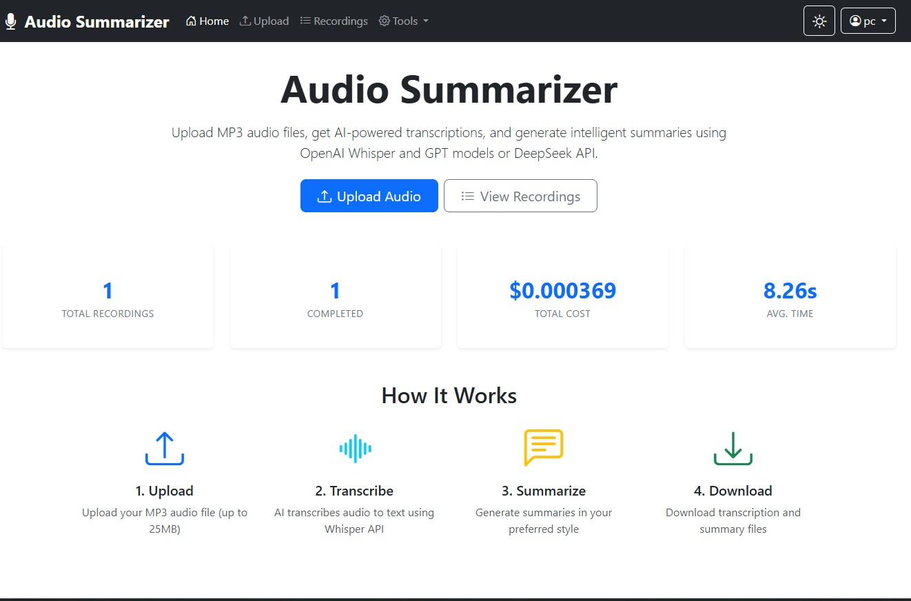
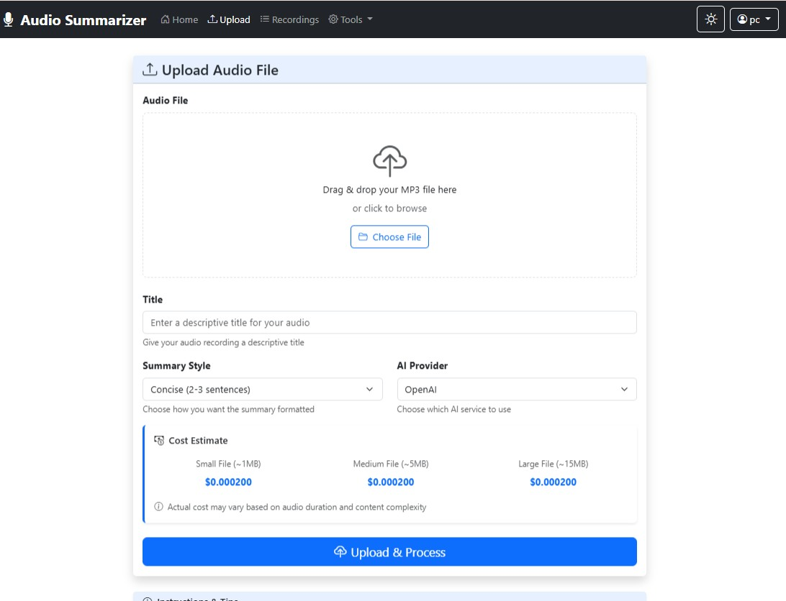
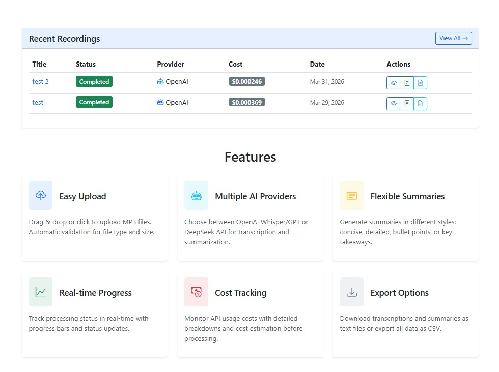
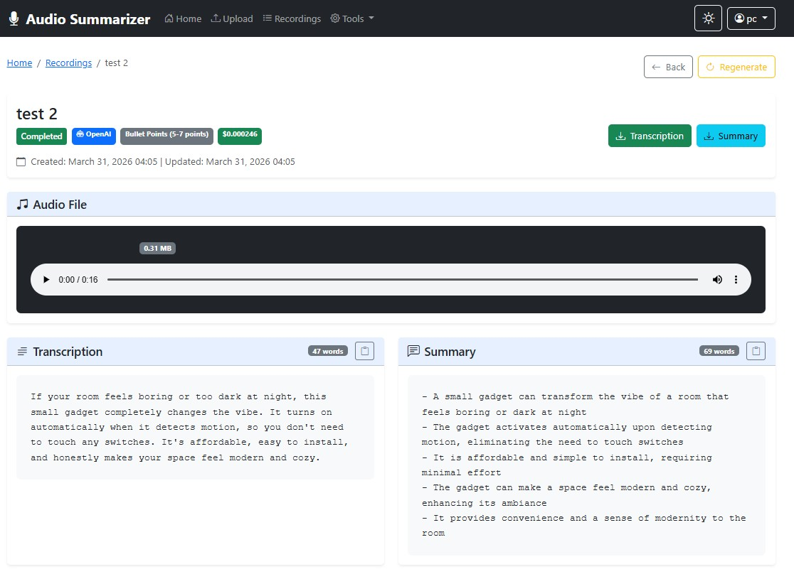
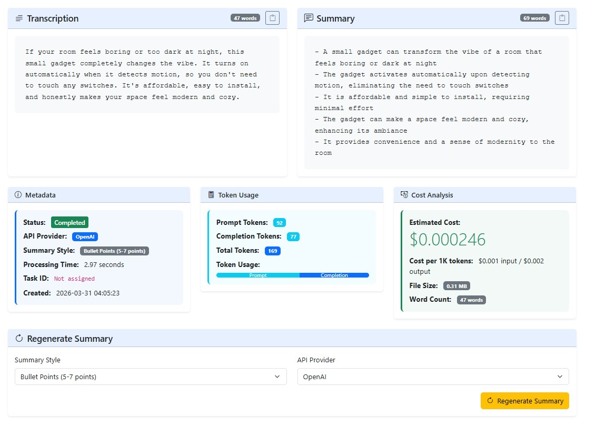
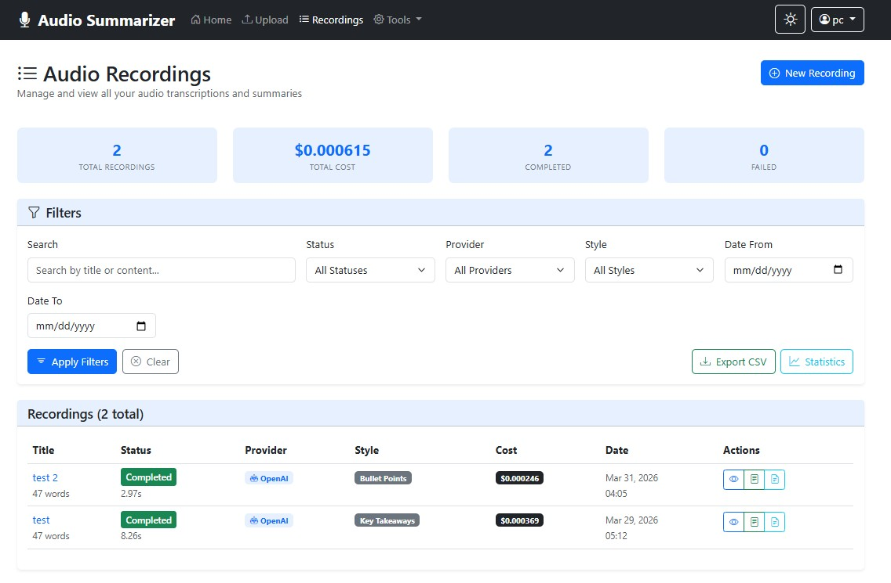

# Audio Summarizer System

A Django-based web app that uploads MP3 audio, transcribes it with AI, and generates summaries in different styles.

## 🚀 Highlights

- MP3 upload and processing workflow
- AI transcription + AI summarization
- Multiple summary styles: concise, detailed, bullet points, key takeaways
- Provider switching (OpenAI / DeepSeek)
- Cost and token tracking per recording
- REST API endpoints for integration
- Celery task support with synchronous fallback

---

## 🖼️ Screenshots

> These images are loaded directly from the `images` folder in this repository.

### 1) Home / Dashboard


### 2) Upload Page


### 3) Processing / Status View


### 4) Recording List


### 5) Recording Detail


### 6) Summary Regeneration


---

## 🧰 Tech Stack

- **Backend:** Django 4.2
- **API:** Django REST Framework
- **Async:** Celery + Redis
- **AI Integration:** OpenAI SDK, HTTP provider integrations
- **DB:** SQLite (default)
- **Frontend:** Django templates + Bootstrap

---

## 📁 Project Structure

```text
audio_summarizer/
├── audio_summarizer/         # Django project settings
├── transcriber/              # Core app (models, views, tasks, api)
├── templates/transcriber/    # UI templates
├── images/                   # README screenshots
├── media/audio/              # Uploaded audio files
├── requirements.txt
├── manage.py
└── README.md
```

---

## ⚙️ Quick Start

### 1) Create virtual environment

```bash
python -m venv venv
```

### 2) Activate virtual environment

**Windows (cmd):**

```bat
venv\Scripts\activate
```

**macOS/Linux:**

```bash
source venv/bin/activate
```

### 3) Install dependencies

```bash
pip install -r requirements.txt
```

### 4) Configure environment

Create/edit `.env` and set at least:

- `SECRET_KEY`
- `OPENAI_API_KEY`
- `DEEPSEEK_API_KEY` (optional if not using DeepSeek)

### 5) Run migrations

```bash
python manage.py migrate
```

### 6) Start the app

```bash
python manage.py runserver
```

Open: `http://127.0.0.1:8000/`

---

## 🔄 Optional Async Processing (Celery)

If Redis + Celery are running, tasks execute in background workers.

```bash
celery -A audio_summarizer worker --loglevel=info
```

If Celery/Redis is unavailable, the app falls back to synchronous processing.

---

## 🌐 API (Basic)

- `POST /api/upload/` — upload audio
- `GET /api/status/<id>/` — check processing status
- `GET /api/result/<id>/` — fetch result
- `POST /api/regenerate/<id>/` — regenerate summary
- `GET /api/stats/` — usage stats

---

## 📌 Notes for GitHub Upload

- Keep this README at: `audio_summarizer/README.md`
- Keep screenshot files in: `audio_summarizer/images/`
- The current image links use relative paths (`images/1.jpg` ... `images/6.jpg`) and will render correctly on GitHub.

